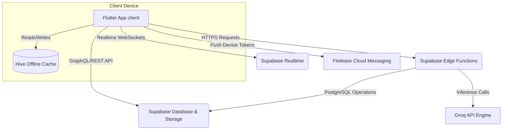
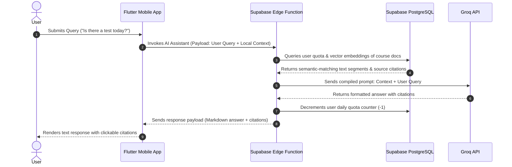

# UniShareSync
### Centralized University Collaboration & Campus Management App

[](https://flutter.dev)
[](https://supabase.com)
[](https://firebase.google.com)
[](https://groq.com)

**UniShareSync** is a comprehensive, cross-platform mobile application designed to centralize university academic workflows, student collaboration, and campus management services into a single, cohesive ecosystem. Developed using **Flutter** and powered by **Supabase** and **Firebase Cloud Messaging (FCM)**, the platform integrates academic resources, AI-powered assistance, collaborative workspaces, peer-to-peer commerce, real-time transportation tracking, and alumni networking into a secure, role-based application.

---

**Academic Affiliation**  
Department of Computer Science & Engineering (CSE) & CSIT  
*Shanto Mariam University of Creative Technology*

---

## 📝 Abstract

Modern university life extends far beyond traditional classrooms, encompassing collaborative projects, community clubs, resource sharing, and staying connected post-graduation. However, these activities are frequently fragmented across multiple applications, offline notice boards, and unstructured communication channels. 

**UniShareSync** addresses these challenges by consolidating academic, collaborative, and campus services into a unified, secure, role-based platform. Built with a scalable backend architecture, it provides key components such as real-time notice broadcasting, GPS bus tracking, interactive project workspaces (Kanban and collaborative whiteboards), AI-assisted resource summarizing, trust-based peer-to-peer item sharing, and anonymous academic feedback channels. This provides a cost-effective, premium digital infrastructure solution for modern university campuses.

---

## 🎯 Project Objectives

1.  **Centralize Campus Services:** Consolidate academic, administrative, and social utilities into a single mobile dashboard.
2.  **Facilitate Academic Exchange:** Provide a structured Resource Library with search capabilities and instant AI-driven document summaries (RAG).
3.  **Enhance Collaborative Workflows:** Enable project teams to coordinate using real-time Kanban boards, shared digital whiteboards, and faculty supervisor oversight.
4.  **Optimize Campus Logistics:** Deliver live transit coordinates using OpenStreetMap and Supabase Realtime synchronization.
5.  **Secure Peer-to-Peer Transactions:** Create a safe trust-scored marketplace for textbook and hardware lending, renting, or selling, backed by administrative moderation.
6.  **Bridge Alumni-Student Gaps:** Build a verified alumni networking directory to facilitate professional mentorship.
7.  **Provide AI-Powered Support:** Integrate a context-aware AI Campus Assistant utilizing LLMs with resource-grounded answering.

---

## ⚠️ Problem Statement

University campuses often suffer from fragmented communication and decentralized academic resources. Students struggle to find official documents, coordinate group projects, buy/sell course materials safely, or track campus transit routes. Meanwhile, faculty members lack an organized platform to monitor student academic progress, distribute notices, or review academic concerns systematically. UniShareSync eliminates this friction by offering an all-in-one platform built for three distinct roles: **Students**, **Faculty**, and **Administrators**.

---

## 🚀 Key System Features

### 1. User Management & Access Control
*   **Authentication:** Secure registration and login using Email and One-Time Passwords (OTP).
*   **JWT Session Handling:** Robust session persistence managed via secure local storage.
*   **Role-Based Access Control (RBAC):** Customized dashboards, actions, and menu layouts for **Students**, **Faculty**, and **Admins**.
*   **User Profiles:** Custom user profiles with avatars, contact details, and role details.

### 2. Resource Library
*   **Multi-Format Uploads:** Allows users to upload PDFs, DOCX, and PPT files organized by course, department, and semester.
*   **Approval Workflow:** Admin-reviewed upload pipeline ensuring only verified and relevant academic resources are published.
*   **In-App Document Preview:** Integrated PDF and file previewing directly inside the mobile client.
*   **AI Auto-Summary:** Automatic document parsing and generation of concise summaries immediately upon successful upload.
*   **Download Analytics:** Logs and counts download statistics for monitoring resource popularity.

### 3. AI Campus Assistant
*   **Groq API Integration:** Fast LLM inference executed securely through Supabase Edge Functions.
*   **Free/Pro Query Allocation:** 5 free queries per user per day, with option to input a personal Groq API key for unlimited queries.
*   **RAG Answering:** Context-rich replies grounded in uploaded course PDFs with citations referencing the exact source documents.
*   **Live Context Injection:** Current campus activities, schedules, and active notice details are appended to queries for context-aware responses.

### 4. Notice Board
*   **Priority Coding:** Notices are flagged by severity: **Urgent**, **Normal**, and **Important**.
*   **Broadcast Channels:** Instant FCM push notification broadcasts dispatched to all active campus users when a notice is published.
*   **Rich Attachments:** Supports image and document attachments to notices.

### 5. ProjectHub
*   **Kanban Board:** Interactive visual task tracking containing *Backlog*, *In Progress*, *Testing*, and *Done* states.
*   **Collaborative Whiteboard:** A real-time whiteboard with multi-user presence cursors, utilizing raw drawing paths (`perfect_freehand`) synchronized instantly over Supabase channels.
*   **Supervisor Assignment:** Team-based project setup where students request and assign a faculty advisor as supervisor.
*   **Progress Monitoring:** Course-wise and semester-wise faculty dashboard monitoring project status.
*   **At-Risk Alerts:** Automated warnings flags projects with low commit activity or stalling tasks.

### 6. Events & Seminars
*   **Ticket Payment Verification:** Integrates free and paid events with local gateway (bKash/Nagad) transaction verification.
*   **Waitlist Management:** Auto-queueing of users once the seat limit is reached.
*   **Check-In Mode:** Event organizers can scan QR tickets or search attendee names to check in participants at the door.
*   **Certificate Generation:** Automatic, server-side PDF certificate creation matching attendee registration details upon event completion.

### 7. Communities
*   **Structured Hierarchy:** Supports organizational hierarchies (e.g., *Faculty Head* $\rightarrow$ *President* $\rightarrow$ *VP* $\rightarrow$ *Secretary* $\rightarrow$ *Member*).
*   **Internal Communication:** Dedicated community notice boards and activity feeds.
*   **Analytics Dashboard:** Visual indicators displaying member engagement, event counts, and post counts using `fl_chart`.

### 8. CampusShare
*   **Peer-to-Peer Marketplace:** Secure listing of textbook and hardware items for borrowing, renting, or selling.
*   **Digital Agreements:** Auto-generates a borrow/rent agreement document with digital signature verification.
*   **Trust Scores:** User rating metric (0–100) that fluctuates based on late returns, item conditions, and feedback.
*   **Penalties & Disputes:** Daily late fees automatically calculated; damage disputes are routed directly to Admins for resolution.

### 9. Lost & Found
*   **Visual Reports:** Image-backed reports with categories, descriptions, and location tracking.
*   **Status Management:** Live progression pipeline: *Open* $\rightarrow$ *Matched* $\rightarrow$ *Resolved*.

### 10. Feedback System
*   **Confidential Submissions:** Option to submit feedback anonymously or identified.
*   **Categorization:** Categorized under *Academic*, *Technical*, or *General* directories.
*   **Resolution Tracker:** Live status tracking from *Submitted* $\rightarrow$ *Under Admin Review* $\rightarrow$ *Responded*.

### 11. Notification Center
*   **FCM Push Notifications:** Targeted system broadcasts or role-specific notifications (e.g., student-only or faculty-only notices).
*   **In-App Realtime Feed:** A live feed displaying notification updates immediately without app restarts.
*   **Notification Badge counts:** Live, unread badge indicators.

### 12. Class Scheduler
*   **Dynamic Timetable:** Displays scheduled lectures filtered by department, semester, and current time.
*   **Live Room Lookup:** Checks which classrooms are currently vacant.
*   **Hive Cache Integration:** Stores schedules locally on the device for complete offline functionality.

### 13. Campus Bus Tracker
*   **Live Coordinates:** Real-time driver location broadcasting (updates every 8 seconds) visualised on an OpenStreetMap interface via `flutter_map`.
*   **Driver Mode:** One-button broadcast mode for shuttle drivers using geolocator APIs.
*   **Color-Coded Routes:** Clean visual distinctions for different bus routes.
*   **Offline Schedule:** Fallback timetable schedule when driver is offline.

### 14. AlumniConnect
*   **Alumni Directory:** Filterable registry sorted by graduation batch (Batch 2003 – present), current job role, and company.
*   **Mentorship Requests:** Direct "Request to Connect" trigger sending formatted emails to requested alumni mentors.
*   **Registration Verification:** Self-registration portal requiring manual admin verification.

### 15. Admin Panel
*   **Resource Moderation:** Approve or deny student file uploads.
*   **User & Role Management:** Alter user roles, ban users, or verify alumni.
*   **Dispute Center:** Admin resolution hub for CampusShare late penalties or damage conflicts.
*   **Community Oversight:** Moderation and closure of inactive community channels.
*   **AI Analytics:** Detailed breakdown of token usage and query tallies on Supabase Edge functions.

---

## 🛠️ Tech Stack & Libraries

### Frontend Architecture
*   **Framework:** Dart & Flutter (SDK >=3.0.0)
*   **State Management:** Riverpod (`flutter_riverpod`)
*   **Local Caching:** Hive & SharedPreferences (offline schedule and local authentication states)
*   **Data Models:** Freezed/JSON Serializable mappings
*   **Drawing & Maps:** `perfect_freehand` (Whiteboard) and `flutter_map` / `latlong2` (OpenStreetMap)
*   **Charts:** `fl_chart` (Community and Admin analytics)

### Backend & Cloud Infrastructure
*   **Database:** Supabase PostgreSQL with Row Level Security (RLS)
*   **Realtime Subscriptions:** Supabase Realtime Channels (Whiteboard cursors, Bus Tracking GPS, In-App notifications)
*   **Storage Buckets:** Supabase Storage (Resources, Profile avatars, Lost & Found images)
*   **Serverless Logic:** Supabase Edge Functions (TypeScript) hosting:
    *   Groq API client integrations
    *   PDF/Resource text extraction (RAG pipeline)
    *   PDF certificate generations
*   **Push Broker:** Firebase Cloud Messaging (FCM)
*   **Local Notifications:** `flutter_local_notifications`

---

## 📐 Architecture & Flow Diagrams

### High-Level System Architecture



### Main RAG Pipeline Feature Flow



---

## 📁 Repository Directory Structure

```text
lib/
├── assets/                  # App images, logos, and raw vector assets
├── core/                    # App constants, global themes, shared widgets, and network utilities
│   ├── theme/               # Core design tokens, colors, styles
│   └── utils/               # App helper modules, formatters, and validators
├── data/                    # Data sources, database repositories, and services wrappers
├── features/                # Domain-driven feature modules
│   ├── admin/               # Admin dashboards, moderator interfaces, and analytics
│   ├── ai_chat/             # AI Campus Assistant UI and messaging logic
│   ├── alumni/              # Alumni directory search and connection flow
│   ├── auth/                # Sign In, Sign Up OTP screens, and state providers
│   ├── bus_tracker/         # Bus tracker map integration, driver broadcast state
│   ├── communities/         # Student organizations, committees, and activity feeds
│   ├── dashboard/           # Home dashboards matching user roles (Student/Faculty/Admin)
│   ├── events/              # Event lists, payment workflows, QR ticketing
│   ├── faculty/             # Faculty monitoring dashboard components
│   ├── feedback/            # Anonymous feedback reporting & tracking
│   ├── item_share/          # CampusShare marketplace, rental forms, trust scores
│   ├── lost_found/          # Reports, categories and matches UI
│   ├── models/              # Shared data representations (User, Notice, Ticket)
│   ├── notice_board/        # Notice grid, priority-coded details UI
│   ├── notification_center/ # Notification history feed and badge counts
│   ├── onboarding/          # App intro slides and setup walkthroughs
│   ├── profile/             # Profile details, photo update logic
│   ├── projects/            # ProjectHub workspace, Kanban, whiteboard drawing canvases
│   ├── resources/           # Academic resource uploads, categories and pre-viewers
│   ├── scheduler/           # Routine tables, Hive database local adapter
│   └── splash/              # Initial loading animation and state initialization check
├── providers/               # App state providers (Riverpod notifier declarations)
├── services/                # Device services (FCM listener, Location GPS, Hive configuration)
└── main.dart                # App entrypoint initializing Firebase, Supabase and Hive
```

---

## ⚙️ Getting Started & Setup Guide

### 📋 Prerequisites
Before running the application, make sure your machine has the following tools installed:
*   [Flutter SDK](https://docs.flutter.dev/get-started/install) (version `>= 3.0.0`)
*   [Dart SDK](https://dart.dev/get-tools)
*   [Supabase CLI](https://supabase.com/docs/guides/cli) (Recommended for local database migrations)
*   An active [Firebase Project](https://console.firebase.google.com/) for FCM capabilities

### 🔧 Installation Steps

1.  **Clone the Repository:**
    ```bash
    git clone https://github.com/mhjayeed715/UniShareSync-Mobile-App.git
    cd UniShareSync-Mobile-App
    ```

2.  **Install Dependencies:**
    ```bash
    flutter pub get
    ```

3.  **Supabase Backend Setup:**
    *   Create a new project on the [Supabase Dashboard](https://supabase.com).
    *   Execute the SQL schema migrations (found under `supabase/migrations/`) within the SQL Editor of your Supabase console to spin up the tables, triggers, and storage buckets.
    *   Deploy the Edge Functions:
        ```bash
        supabase functions deploy ai-assistant --project-ref <your-supabase-project-id>
        ```

4.  **Firebase Messaging Setup:**
    *   Create a project in the Firebase Console and register both Android and iOS applications.
    *   Download your generated `google-services.json` (for Android) and `GoogleService-Info.plist` (for iOS) and place them in their respective native directories:
        *   Android: `android/app/google-services.json`
        *   iOS: `ios/Runner/GoogleService-Info.plist`
    *   Register your device's APNs / FCM keys inside the project configuration.

5.  **Environment Configuration:**
    Create a local environment configuration file or edit your environment targets with the credentials:
    ```env
    SUPABASE_URL=https://<your-supabase-project-id>.supabase.co
    SUPABASE_ANON_KEY=<your-supabase-anonymous-key>
    GROQ_API_KEY=<your-groq-api-key>
    ```

6.  **Run the App:**
    Connect a physical device or emulator, and execute:
    ```bash
    flutter run
    ```

---

## 🔮 Future Roadmap

-   **Web-based Administration Portal:** A dedicated React/Vite dashboard allowing administrators to handle tickets, notice broadcasts, and audit logs on a desktop browser window.
-   **Multi-Campus Partitioning:** Support multiple university campuses with localized scheduling, notice distribution, and route networks.
-   **Predictive Early-Warning Dashboard:** The "Academic Risk Radar" to predict students at risk of course failure based on project delays and missed lectures.
-   **Bangla Voice Accessibility:** Voice integration supporting natural language commands in Bangla for blind or visually impaired students navigating the bus tracker and resource boards.

---

## 📜 References

1.  **Flutter Framework Documentation:** [flutter.dev/docs](https://flutter.dev/docs)
2.  **Supabase Backend Platform:** [supabase.com/docs](https://supabase.com/docs)
3.  **Groq Cloud Console API:** [console.groq.com/docs](https://console.groq.com/docs)
4.  **Firebase Cloud Messaging Services:** [firebase.google.com](https://firebase.google.com)
5.  **OpenStreetMap Project Foundation:** [openstreetmap.org](https://openstreetmap.org)

---

## ⚖️ License
This project is licensed under the MIT License - see the LICENSE file for more information.